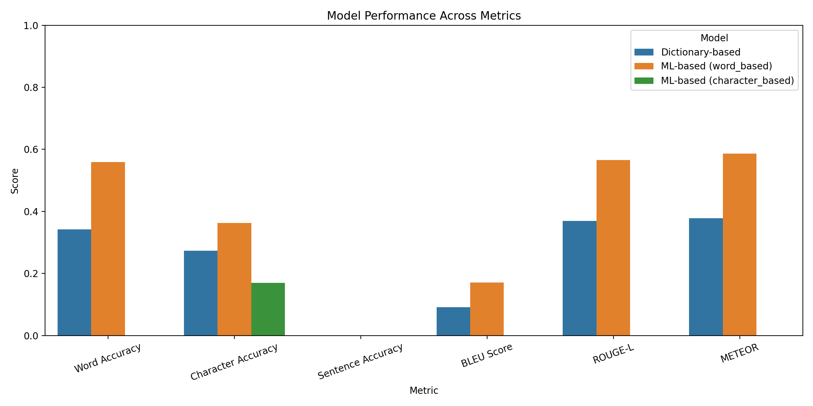
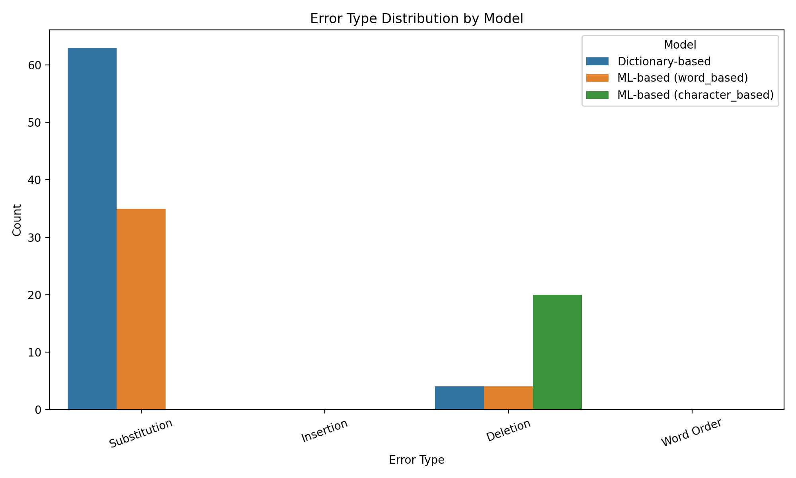
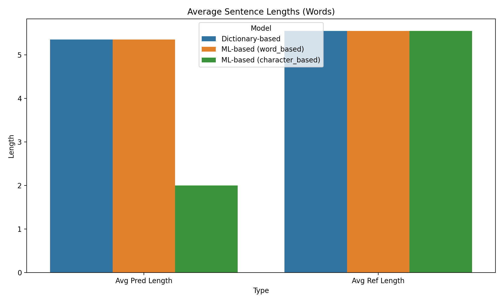
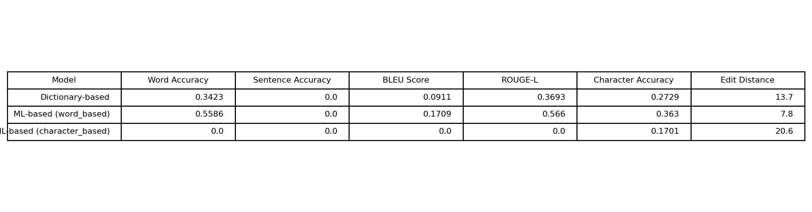

# Roman Urdu to Urdu Conversion — Evaluation Report

Date: 2025-09-02T23:18:37.021919

## Overview
This report summarizes the performance of implemented models for Roman Urdu to Urdu conversion, including dictionary-based and ML-based approaches.

## Models Evaluated
- Dictionary-based — Test samples: 20
- ML-based (word_based) — Test samples: 20
- ML-based (character_based) — Test samples: 20

## Metric Summary
| Model                      |   Word Accuracy |   Sentence Accuracy |   BLEU Score |   ROUGE-L |   Character Accuracy |   Edit Distance |
|:---------------------------|----------------:|--------------------:|-------------:|----------:|---------------------:|----------------:|
| Dictionary-based           |        0.342342 |                   0 |    0.0910541 |  0.369301 |             0.272904 |            13.7 |
| ML-based (word_based)      |        0.558559 |                   0 |    0.170866  |  0.566039 |             0.363029 |             7.8 |
| ML-based (character_based) |        0        |                   0 |    0         |  0        |             0.170055 |            20.6 |

## Visualizations

## Recommendations
- Best overall model: `ml_model_word_based` with weighted score 0.275
- dictionary_model: Word accuracy is low (34.23%). Consider expanding dictionary or improving training data.
- dictionary_model: BLEU score is low (0.091). Consider improving sequence-level modeling.
- dictionary_model: Dictionary coverage is low. Add more word mappings.
- ml_model_word_based: Word accuracy is low (55.86%). Consider expanding dictionary or improving training data.
- ml_model_word_based: BLEU score is low (0.171). Consider improving sequence-level modeling.
- ml_model_character_based: Word accuracy is low (0.00%). Consider expanding dictionary or improving training data.
- ml_model_character_based: BLEU score is low (0.000). Consider improving sequence-level modeling.